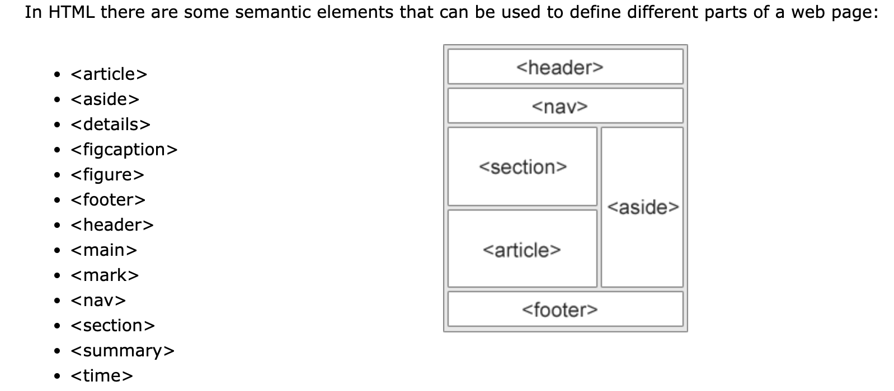

# Welcome to my Code Refactor! 

Welcome! For those of you who have never heard of the term “code-refactor”, don’t worry, because two weeks ago, I hadn’t either! “Code-refactor” is basically when you modify pre-existing code without changing the functionality or appearance of it. My task was to remove “div” tags, and replace them with tags that have a more meaningful description. Below is a snippet of what the website looks like, as well as the link. Enjoy! 

[Deployed Website](https://amylipscomb.github.io/code-refactor/)

<strong>The Challenge</strong>

 I briefly described what the task of the assignment was, but I'll explain my process and the purpose even deeper now. Two weeks ago, I had never even heard of the terms, "div" or "semantic" tags, and I certaintly did not know the difference or how they should be applied. A "div" tag is a general tag that coders can use in HTML to seperate the content into various sections. It can be useful, however it can also be confusing for coders who are not familiar with the code to follow along while reading it. This is where the importance of semantic tags come into play. Semantic tags, are tags that can be used to seperate the content by using descriptive words. There are "header" tags, "section" tags, "aside" tags, and "footer" tags, to name a few. These tags are extremely helpful in code, because immediately someone can read a section, and know if they're looking at coding that's meant for the header, paragraph or footer. Below is a screenshot of the list of semantic tags I heavily utilized to modify the coding to the website. 

 
		 
In changing the HTML code to utilize semantic tags, that meant that the CSS selectors had to be changed. Below is an example of what I mean. In HTML, I changed the tag, to the semantic tag, "header", and then changed the CSS selector to "header" as well. 

HTML Screenshot

CSS Screenshot

I continued to match the HTML and CSS code in VS Code.

<strong>Technologies Used</strong>	

-	HTML 
-	CSS
-	VS Code